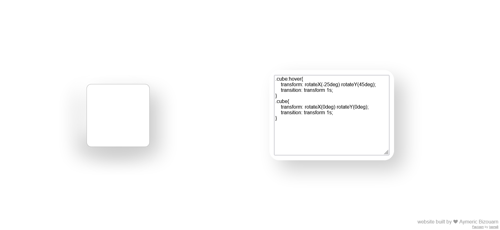

# CSS-Animator-GUI [](https://github.com/bizouarn/CSS-Animator-GUI/actions/workflows/gh-pages.yml)
## Simple HTML CSS GUI to test animations or CSS transitions



# Development

```
pnpm install
pnpm run dev
```

# Build

```
pnpm run build
```
